# Security handbook for developers
<div class="title-block" style="text-align: center;" align="center">
<div align="center">
  
</div>
</div>

> *"Hackers don’t break in — they walk through the door you left open."* 

## 1. SSH Keys: Hackers' Easiest Target & Prime Hotspots
Let's be honest—every developer, at least once, has raced through ssh-keygen in a caffeine-fueled haze, hammered Enter three times to skip the passphrase, and thought, "I'll add it later… maybe." 🤷‍♂️ But guess what? That heroic shortcut is like leaving your car unlocked with the keys in the ignition and a "Please Steal Me" bumper sticker.

If some sneaky hacker nabs your unencrypted private SSH key, they don't need to knock—they walk right in. They can masquerade as you on your servers or GitHub, push malicious code, raid private repos, and throw a root-level rave in your infrastructure. Trust me, that's a party you don't want an uninvited guest at.
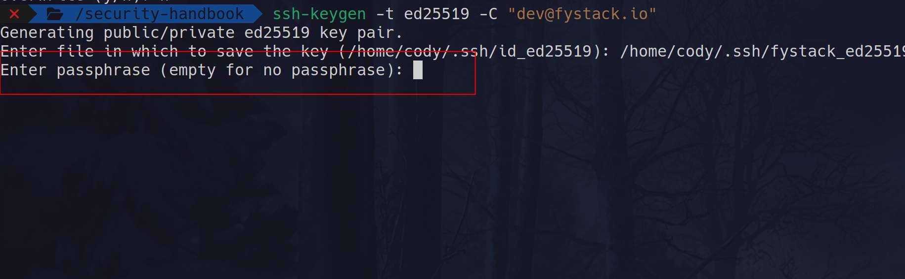
There have even been exploits—like the SSH-key-scan honeypot attack (see https://www.ssh.com/blog/ssh-key-scan-attack-honeypot)—that prey on keys without passphrases. 

Don't be that person who leaves the passphrase blank. Instead, channel your inner secret-agent and pick a passphrase like C0ffee#Mug@3xtraShot (words + numbers + special chars = 💪). Your future self (and your servers) will thank you! And remember: rotate those keys every month, because even the best locks need fresh keys now and then.


If you provide an empty passphrase when generating an SSH key, the private key will not be encrypted. This means:
Anyone who gains access to your private key file (e.g., via a compromised machine, malware, or accidental exposure) can use it without any restriction to authenticate as you.

There will be no additional layer of security beyond file system permissions.

Attackers can use stolen private keys immediately, making them a prime target in exploits.

By setting a strong passphrase, your private key is encrypted with that passphrase, meaning:

Even if someone steals your private key file, they cannot use it without knowing the passphrase.

It adds an extra layer of security, making it much harder for attackers to exploit.

For security best practices, developers should rotate their SSH keys every month to minimize the risk of compromise. Regular key rotation helps prevent unauthorized access in case a key is exposed or compromised.

## 2. Don't Let Hackers Impersonate You, Lock Down Commits with GPG
Why would a hacker forge your commits? How do they pull it off?
- **Sneak in malicious code**: By masquerading as a trusted contributor, they slip dangerous payloads into your codebase.
- **Corrupt your audit trail**: Fake author metadata clouds the "blame" history, making investigations a nightmare.
- **Exploit CI/CD**: A forged commit can trigger automated pipelines, provisioning backdoors or leaking secrets.

How they hack through forged commits:

Spoofing Git metadata
```
git commit --author="You <you@domain.com>" -m "Awesome new feature"
```

Signed commits add an extra layer of security by proving the authenticity of code contributions. This prevents commit forgery and ensures that only verified developers contribute to the codebase.

A signed commit with verified badge
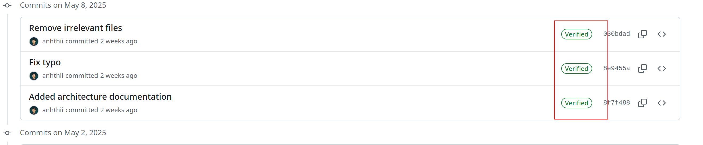

When ever you sign a commit, you must enter the password for the GPG key.
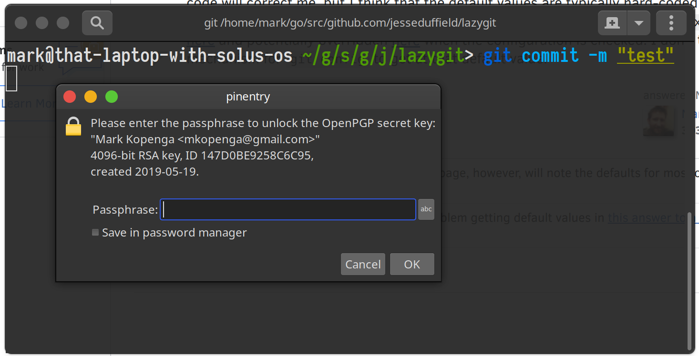

Additonally, to be able to push code to Github, you must enter the passphrase for the SSH key. This create 2 layers of protection similar to multi factor authentication.

When generating GPG key, should generate with an expiration. Recommendation is 3m ( 3months)

Adding GPG key in Github Account Setting
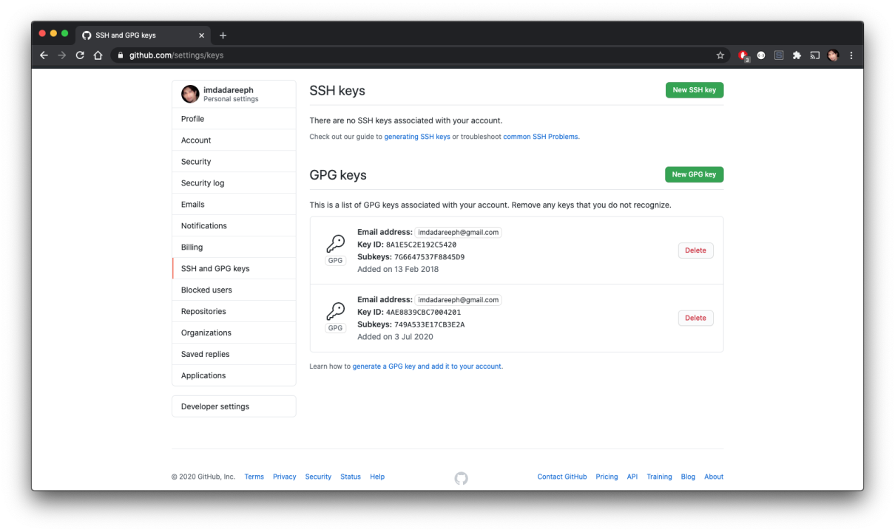

## 3. No Blind Installs: Treat Each Package Like a Potential Trojan
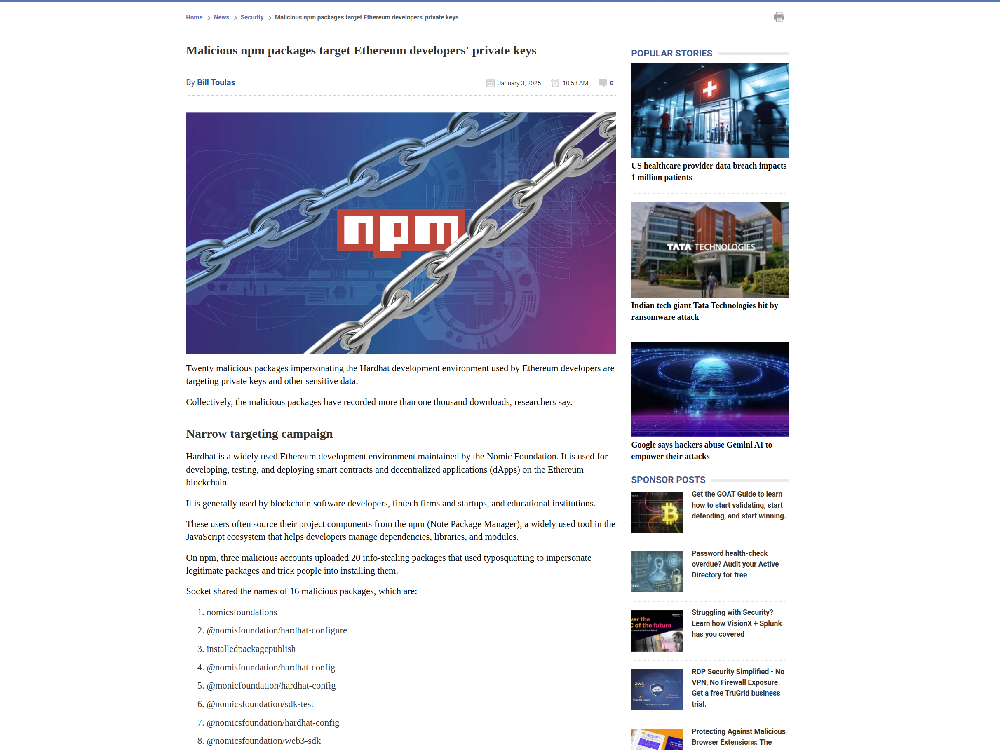
The open-source package ecosystems: npm, PyPI, Go modules and beyond are prime real-estate for supply-chain attacks. One malicious dependency can turn your entire codebase into a backdoor. Before running any install command, treat each package as if it were a Trojan waiting to strike.

#### Real-World Supply-Chain Ambushes
- [Malicious NPM Packages Target Ethereum Developers' Private Keys](https://www.bleepingcomputer.com/news/security/malicious-npm-packages-target-ethereum-developers-private-keys/)
- [Hackers Deploy Malicious npm Packages Targeting Crypto Users](https://thehackernews.com/2025/01/hackers-deploy-malicious-npm-packages.html)
- [Ripple's xrpl.js npm Package Backdoored with Malicious Code](https://thehackernews.com/2025/04/ripples-xrpljs-npm-package-backdoored.html)
- [Malicious Python Package Found Stealing Ethereum Private Keys](https://www.scworld.com/brief/malicious-python-package-found-stealing-ethereum-private-keys)
- [TON Wallet Security Threat: Malicious NPM Package Steals Cryptocurrency Wallet Keys](https://socket.dev/blog/ton-wallet-security-threat-malicious-npm-package-steals-cryptocurrency-wallet-keys)
- [The trojanized Golang BoltDB repo went undetected for over three years](https://www.theregister.com/2025/02/04/golang_supply_chain_attack/?utm_source=chatgpt.com)

#### Common Attack Patterns

- **Typosquatting & Look-Alikes**  
  Packages with names almost identical to popular ones (e.g., `coa` vs. `c0a`) sneak past casual installs.  
- **Compromised Maintainers**  
  If a trusted owner's account is hijacked, legitimate libraries can be laced with malware.  
- **Dependency Confusion**  
  Publishing internal package names publicly tricks CI/CD pipelines into fetching malicious versions.  
- **Obfuscated Malware**  
  Minified or compiled code conceals data-stealing routines (SSH keys, API secrets, wallet private keys).

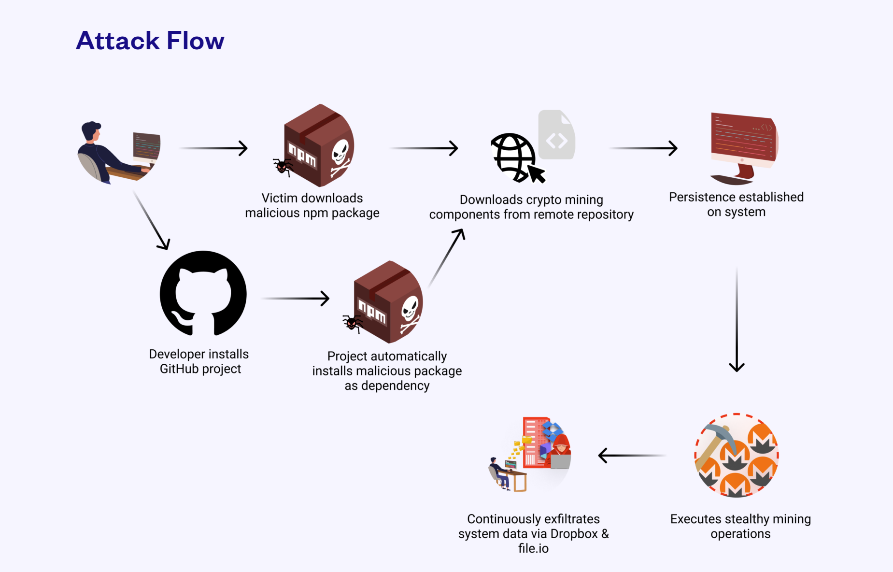

#### 🛡️ Pre-Installation Security Checklist
1. **Authenticate the Source**  
   - Install only from official registries and verify the maintainer's identity.  
   - Run `npm audit`, `pip audit`, or use tools like Socket.dev for deep SCA scans.  
2. **Pin & Inspect Your Dependencies**  
   - Commit lockfiles (`package-lock.json`, `go.sum`, `requirements.txt`).  
   - Preview dependency trees with `npm ls`, `go mod graph`, or `pipdeptree`.  
3. **Spot Typosquats**  
   - Double-check package names against the registry and GitHub repo links. 

#### 🔍 Internal Security Review Workflow
1. **Submit Every New Dependency** to the security team before merging.  
2. **Verify Maintainers & History**  
   ```bash
   npm info <package>
   pip index versions <package>

### 4. 🐳 Don't Let Docker Be Your Trojan Horse: Lock Down Your Containers
Containers are like magic boxes: lightweight, portable, and fast. But guess what? If you treat them like black boxes and skip security, they’ll behave like Pandora’s Box—spilling vulnerabilities into your entire infrastructure.

> A container isn't a sandbox unless you make it one.

- **[Tesla Kubernetes Hack (2018)](https://arstechnica.com/information-technology/2018/02/tesla-cloud-resources-are-hacked-to-run-cryptocurrency-mining-malware/)** – Attackers exploited an open Kubernetes dashboard to deploy cryptominers using Docker containers.

- **[Docker Hub Data Breach (2019)](https://thehackernews.com/2019/04/docker-hub-data-breach.html)** – Docker's own registry was breached, exposing 190,000 user credentials and potentially affecting CI/CD pipelines.

- **[TeamTNT Docker API Attacks (2020–2021)](https://www.bleepingcomputer.com/news/security/teamtnt-hackers-target-your-poorly-configured-docker-servers/)** – The TeamTNT group exploited unauthenticated Docker daemons to run cryptominers and harvest credentials.

- **[Kinsing Malware on Docker (2020)](https://www.aquasec.com/blog/threat-alert-kinsing-malware-container-vulnerability/)** – Kinsing malware abused exposed Docker APIs to deploy mining containers and scan for SSH creds.

- **[Graboid Docker Worm (2019)](https://unit42.paloaltonetworks.com/graboid-first-ever-cryptojacking-worm-found-in-images-on-docker-hub/)** – The first Docker worm spread through unsecured Docker daemons, mining crypto on infected hosts.

- **[SaltStack RCE via Docker (2020)](https://www.immersivelabs.com/resources/blog/hackers-are-currently-attacking-vulnerable-saltstack-systems/)** – Attackers leveraged RCE flaws in SaltStack to compromise Docker hosts and run cryptominers.

- **[Dero Miner Targeting Docker (2025)](https://www.techradar.com/pro/security/misconfigured-docker-instances-are-being-hacked-to-mine-cryptocurrency)** – A cryptomining worm exploited misconfigured Docker daemons to mine the Dero privacy coin.

#### Best Practices for Secure Docker Usage

1. Never Run Containers as Root
- Add a USER directive in your Dockerfile to drop privileges.
- Avoid --privileged or mounting /proc, /sys, /dev.
```
# ❌ Don't do this
# USER root

# ✅ Use a non-root user
RUN useradd -m appuser
USER appuser
```
2. Use Minimal Base Images
- Cut the bloat: more tools = more vulnerabilities.
- Use distroless, alpine, or scratch images where possible.
```
# ✅ Small and secure base image
FROM alpine:3.20
```

3. Scan Images for Vulnerabilities Before Deployment
Use tools like:
- Trivy: https://github.com/aquasecurity/trivy
- Dockle: https://github.com/goodwithtech/dockle
4. Sign and Verify Docker Images

Use Docker Content Trust (DCT) or [Cosign](https://github.com/sigstore/cosign) to ensure integrity.

5. Avoid Leaking Secrets in Docker Images

- Never COPY .env or .aws files into your image.

- Use --build-arg, dynamic injection, or Vault.
```
# ❌ Bad
COPY .env /app/.env

# ✅ Better
ARG API_KEY
ENV API_KEY=$API_KEY
```
6. Use Docker Networks + Firewalls Wisely

- Don’t expose ports to the world. Use internal-only networks for inter-container comms.
- Avoid publishing 0.0.0.0:xxxx unless absolutely necessary.

```
# ✅ Limit to localhost
-p 127.0.0.1:8080:80
```

7. Monitor and Limit Container Resource Usage
- Prevent runaway containers with limits:
```
docker run --memory=256m --cpus=0.5 myapp
```
8. Keep Docker & Host Up-To-Date
- Always patch vulnerabilities on the Docker daemon and the host OS.
- Consider distros like Bottlerocket or Flatcar designed for containers.

9. Runtime Security with eBPF + Sandboxing
- eBPF-based monitoring: Tools like [Cilium Tetragon](https://github.com/cilium/tetragon) detect suspicious syscalls and behavior.
- Use gVisor or Kata Containers: Sandbox containers with hardened kernels.


### 5. Secure Your CI/CD Pipelines: Attackers Love Automated Trust

**Why It Matters**:
Your CI/CD pipeline has the keys to the kingdom: access to source code, secrets, cloud credentials, and deployment mechanisms. If compromised, it becomes the perfect platform to inject malware into every release.

Major CI/CD Security Breaches

- [SolarWinds Orion (2020)](https://www.reversinglabs.com/blog/ci/cd-security-breaches-update-software-security-approach) – Nation-state attackers inserted a backdoor into the Orion build pipeline, impacting 18,000+ customers.
- [Codecov (2021)](https://about.codecov.io/security-update/) – Attackers tampered with the Bash uploader in CI environments, stealing secrets from thousands of environments.
- [CircleCI (2023)](https://circleci.com/blog/january-4-2023-security-alert/) – Compromise of internal systems led to the theft of environment variables, secrets, and keys from customer pipelines.
- [Travis CI (2022)](https://www.trendmicro.com/en_us/research/22/j/travis-ci-exposed-secrets-in-public-logs.html) – Leaked secrets in build logs exposed thousands of credentials from public CI jobs.
- [PHP Git Server (2021)](https://www.bleepingcomputer.com/news/security/php-official-git-repository-hacked-code-backdoored/) – CI pipeline was hijacked to insert malicious code into the official PHP source repository.
- [SolarMarker via Jenkins (2022)](https://www.reversinglabs.com/blog/ci/cd-security-breaches-update-software-security-approach) – Threat actors exploited Jenkins pipelines to propagate SolarMarker malware through compromised software builds.
- [Codecov-like Bash Uploader Imitation (2021)](https://www.reversinglabs.com/blog/ci/cd-security-breaches-update-software-security-approach) – Malicious clones of popular CI/CD tools distributed malware in CI environments.


Best Practices:
- **Use ephemeral environments**: Rebuild containers and runners on every job.
- **Restrict secrets exposure**: Never expose all secrets to every job; use secret-scoping (e.g., GitHub Actions' env, GitLab CI's protected: true).
- **Require commit signature**: Verification before running deploy jobs.
- **Use OpenID Connect (OIDC)**: to grant temporary cloud permissions via short-lived tokens (instead of long-lived API keys).
- **Audit your pipeline dependencies**: Install only trusted tools and lock versions.
- **Pipeline Isolation & Segmentation**: eparate pipelines by environment: Use different pipelines/runners for dev, staging, and production with appropriate privilege levels.


### 4. Verify Website URLs Carefully Before Downloading Anything

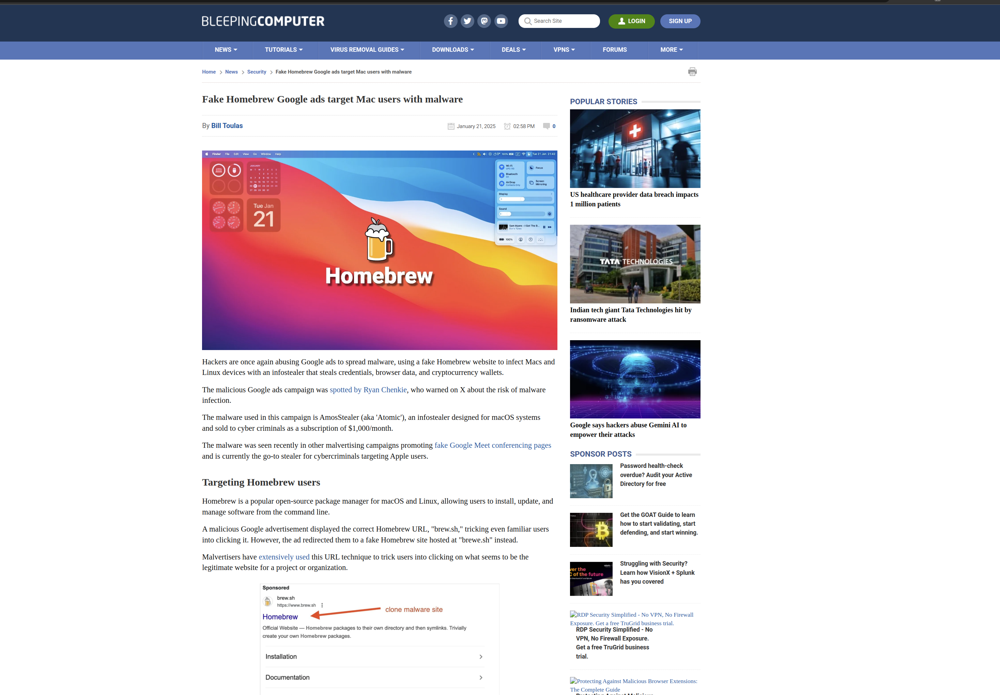

**The Download Trap: When "Official" Isn't Actually Official**

Picture this: You're rushing to install a new tool, you Google it, click the first result, and BAM—you just downloaded malware disguised as legitimate software. Sound far-fetched? It happens thousands of times daily. Even Homebrew, macOS's most trusted package manager, has been [targeted by sophisticated phishing campaigns](https://www.bleepingcomputer.com/news/security/fake-homebrew-google-ads-target-mac-users-with-malware/) that fool even experienced developers.

The harsh reality? Attackers have weaponized our convenience culture, exploiting the fact that most developers instinctively click the first search result without a second thought.

---

#### 🎯 How Attackers Hook Unsuspecting Developers

**The Google Ads Hijack**  
Malicious ads often appear *above* legitimate search results, complete with official-looking logos and descriptions.

**Typosquatting Masterclass**  
Attackers register domains that are nearly identical to real ones:
- ✅ **Legit:** `https://nodejs.org`  
- ❌ **Fake:** `https://node-js.org` *(extra hyphen)*  
- ✅ **Legit:** `https://github.com`  
- ❌ **Fake:** `https://g1thub.com` *(letter replaced with "1")*

**SEO Poisoning**  
Fake sites optimize for search rankings, sometimes appearing higher than the actual official site.

---

#### 🛡️ The Developer's Download Defense Playbook

**🔍 Step 1: Source Authentication**
- **Never trust search engines** for software downloads—go directly to official websites
- **Bookmark trusted sources** like GitHub releases, official project sites, and package managers
- **Cross-reference URLs** with official documentation and community forums

**🔒 Step 2: URL Forensics**
- **HTTPS is non-negotiable**—if there's no padlock, there's no download
- **Certificate inspection**: Click the padlock icon and verify the SSL certificate matches the expected organization
- **Domain scrutiny**: Read URLs character by character—attackers count on quick glances

**📦 Step 3: Prefer Package Managers Over Manual Downloads**
```bash
# ✅ Secure: Use official package managers
brew install node          # macOS
apt install nodejs         # Ubuntu/Debian
choco install nodejs       # Windows
npm install -g typescript  # Node.js packages

# ❌ Risky: Manual downloads from random websites
curl https://suspicious-site.com/nodejs.tar.gz
```

**🔍 Step 4: Pre-Installation Scanning**
- **VirusTotal check**: Upload files to [virustotal.com](https://virustotal.com) before execution
- **Hash verification**: Compare checksums with official releases when available
- **Sandbox testing**: Use virtual machines for suspicious downloads

---

#### 🚨 Real-World Attack Case Studies

| **Attack** | **Year** | **Impact** | **Method** |
|------------|----------|------------|------------|
| **PyPI Package Attack** | 2022 | Thousands of infected Python environments | Malicious packages mimicking `pytorch-nightly` |
| **Google Ads Malware Campaign** | 2023 | Mass infections via popular software | Fake download ads for VLC, Notepad++, Brave |
| **NPM Supply Chain Attack** | 2021 | Compromised Node.js projects worldwide | Malware-laden versions of `ua-parser-js` |

---

####  Quick Security Checklist Before Any Download

- [ ] **Source verified**: Is this the official website/repository?
- [ ] **URL inspected**: No suspicious characters or typos?
- [ ] **HTTPS enabled**: Valid SSL certificate present?
- [ ] **Package manager available**: Can I install this via `brew`/`apt`/`npm` instead?
- [ ] **Team consultation**: When in doubt, ask before downloading

**Pro Tip**: Enable safe browsing in Chrome/Firefox/Brave and consider using DNS filtering services like Cloudflare for Families (`1.1.1.3`) to block known malicious domains automatically.

**Remember**: In security, paranoia is not a bug—it's a feature. That extra 30 seconds of verification could save your entire infrastructure from compromise.


### 5. Weaponized PDFs & File Traps: Don't Get Baited
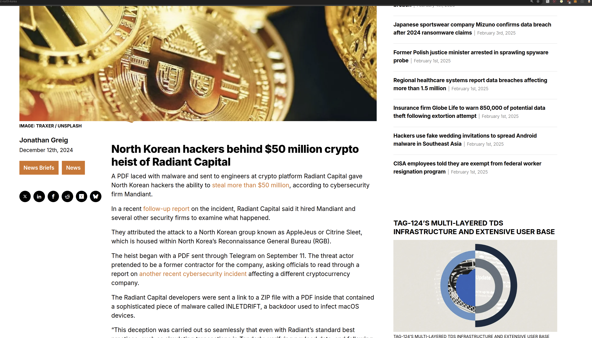

Cybercriminals love when you open random files, especially PDFs via Telegram, email, or Discord. From Radiant to Ronin, multimillion-dollar exploits began with a single careless click.

Be extra cautious when handling PDF files received via email or Telegram. Recently, there have been multiple crypto-related security breaches, such as the Radiant hack (2024) $50m and the Ronin Bridge hack (2022) $615m, caused by employees unknowingly spreading malware embedded in PDF documents.
To minimize risk, please follow these guidelines when handling PDFs:

- **Do NOT download and open PDFs directly** – Instead, if you receive an email with pdf attachements. open them in your browser using services like Google Drive or other secure preview options. **DO NOT** download the files into your machine.

- **Be wary of unexpected attachments** – If you receive a PDF file from an unknown or unexpected sender, verify its legitimacy before opening.

- **Never enable macros or scripts** – Some PDFs may prompt you to enable features that could execute malicious code. Avoid doing this at all costs.

- **Report suspicious files** – If you receive a suspicious or unexpected PDF, report it to [IT/Security Team Contact] before interacting with it.

Use application sandboxing https://www.techtarget.com/searchmobilecomputing/definition/application-sandboxing if you want to open a PDF file from your computer

**Windows**: Windows Sandbox (Built-in, lightweight, and highly secure)

**Linux**: Firejail (Easy-to-use, widely supported, and effective application isolation)

**MacOS**: App Sandbox (Apple's built-in sandboxing mechanism for macOS apps)

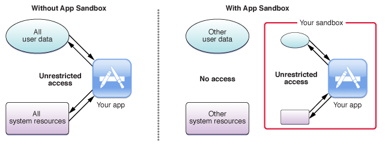
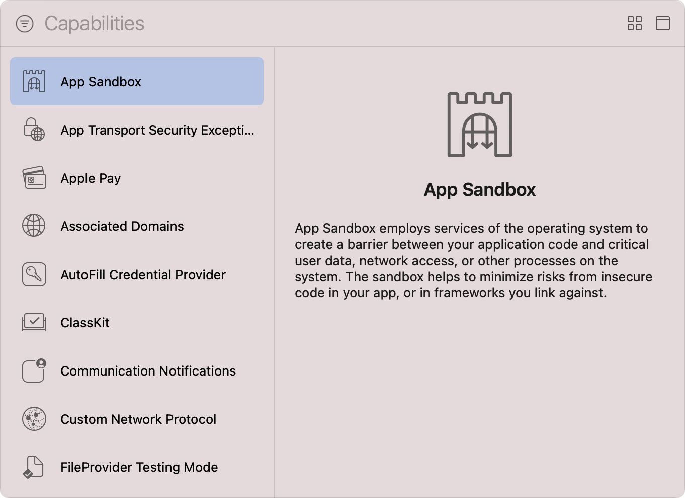

### 6. Enforce Strong Password Practices & Secure Credential Management

Ensuring strong password hygiene is critical to protecting developer accounts, repositories, and infrastructure from unauthorized access. Weak or reused passwords are a major attack vector, leading to account takeovers and data breaches.
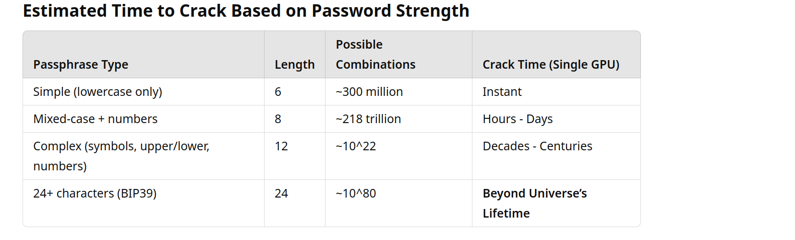

#### Best Practices for Strong Password Security

- Use a Password Manager
  - Developers should never store passwords in plaintext (e.g., in notes, spreadsheets, or browser autofill).
  - Use a trusted password manager such as Bitwarden, 1Password, LastPass, or KeePassXC to securely generate, store, and autofill passwords.
  - Enable 2FA for the password manager itself to prevent unauthorized access.
- Use Strong, Unique Passwords for Each Service
- Generate randomized, long passwords (at least 16-24 characters with uppercase, lowercase, numbers, and special characters).

Example of a secure password:

```
G3#Tz@!p8X7sM$Qy
```

- Avoid using dictionary words or personal details in passwords.
- Rotate Passwords for Critical Applications Regularly
- Critical applications include:
  - GitHub, X, Linkedln, Google Account, crypto wallets, database credentials, cloud infrastructure, any financial, payment, or administrative accounts
- Rotate passwords every 3-6 months or immediately if a security incident is suspected.
- Use password change policies for high-privilege accounts.
- Enable Two-Factor Authentication (2FA) on All Apps
  - MFA is non-negotiable for all developer-related accounts.
  - Prefer hardware security keys (e.g., YubiKey, NitroKey) over SMS or authenticator apps.

- Use Passkeys Where Possible
  - Passkeys (WebAuthn) are a more secure alternative to passwords.
  - Supported by Google, Apple, GitHub, and Microsoft for passwordless authentication.
  - Prevents phishing attacks by eliminating password-based logins.

### 7. Secrets Aren’t for Sharing, Not Even with Your Team

Never share private keys, API secrets, or credentials with anyone—including coworkers.

Do Not Share Credentials: Even within the team, no one should directly share API keys, private keys, or passwords. If access is required, use role-based access controls (RBAC) and secure secret management tools.

Rotate Credentials Regularly: Even if a secret is cobelieved to be safe, implement automated credential rotation policies to reduce exposure risk.

Compromised Secrets Lead to Untraceable Security Breaches

If credentials are leaked or shared, a hack can occur without a clear root cause, making it harder to track which component was infected.

Attackers could move laterally within the system, increasing the difficulty of identifying the entry point of the attack.

### 8. Don't Store Secrets for Development in .env Files – Use a Secure Secret Vault

🚨 Why .env Files Are a Security Risk

.env files can be accidentally committed to Git, exposing secrets in repositories.

Attackers with access to a developer's machine can extract credentials from .env files.

.env files lack access controls, making it impossible to enforce least privilege access.

Secrets in .env files are not automatically rotated, increasing the risk of long-term exposure.

✅ Use a Secure Secret Vault Instead

Recommended Alternative: HashiCorp Vault

Secrets are encrypted on the disk level

Provides dynamic secret injection without storing credentials in local files.

Supports RBAC (Role-Based Access Control) for secure access management.

Allows automatic secret rotation, reducing risk from exposed credentials.

🔧 How to Use HashiCorp Vault Securely

Install HashiCorp Vault
Follow the official installation guide: HashiCorp Vault Docs.

Use vault exec for Secure Secret Injection
Instead of storing secrets in .env files, inject them dynamically when running commands:

```
vault exec -wrap-env my_command
```
Example: Injecting Database Credentials Securely
```
vault exec --env DB_USERNAME --env DB_PASSWORD my_command
```
Vault fetches the secrets securely and injects them as environment variables when executing my_command.

Secrets are never stored in local files or exposed in shell history.

### 9. VPN connection is required to access critical resource
   2FA on VPN Access

To strengthen security, VPN authentication must require Two-Factor Authentication (2FA) using one of the following:
OTP-based authentication (Google Authenticator, Authy, 1Password)

VPN Providers That Support 2FA

🔒 2FA is Mandatory for Critical Services

All employees and contractors must enable 2FA on:
✅ Cloud accounts (AWS.)
✅ Code repositories (GitHub, require Enterprise plan need to consider)
✅ Internal dashboards & admin panels

Extra resources:
https://github.com/ukncsc/secure-development-and-deployment

### 10. Secure Firewall Policy for Developer Desktops

A firewall is a critical security measure for developer desktops, ensuring that unauthorized network traffic—both incoming and outgoing—is properly controlled. Developers often work with sensitive credentials, APIs, and infrastructure that, if exposed, could lead to security breaches.

Key reasons to enforce a strict firewall policy:

Block unauthorized outbound traffic 

- Prevents malware or misconfigured applications from leaking sensitive data.
Restrict inbound access
- Ensures only necessary services (e.g., SSH) are accessible. Mitigate attack risks
- Reduces exposure to threats like port scanning and unauthorized access.

Best Practices for Firewall Rules

- Least Privilege: Allow only necessary services.
- Deny by Default: Block all and allow only required traffic.
- Logging & Monitoring: Enable logging for audit trails.
- Regular Review: Periodically check rules for outdated permissions.
- Use IP Whitelisting: Restrict access to trusted IPs.

Suggested tools to setup firewall: UFW, OpenSnitch

https://ostechnix.com/opensnitch-application-level-firewall-for-linux/

https://www.digitalocean.com/community/tutorials/how-to-set-up-a-firewall-with-ufw-on-ubuntu


### 12. Monitor for Compromised Developer Devices

Even if your backend is locked down, all it takes is one developer's infected laptop to sink the ship — especially if their Git credentials or VPN access isn’t tightly secured.

Suggestions:
- Use **Endpoint Detection & Response (EDR) tools** like CrowdStrike, SentinelOne, or open-source tools like Wazuh.
- **Disable automatic token caching** in CLI tools like GitHub CLI, AWS CLI.
- **Limit SSH agent forwarding**, especially on jump boxes and bastion hosts.
- **Restrict privileged developer laptops from using public Wi-Fi** or enforce VPN-only policies.

### 13. Implement Just-In-Time (JIT) Privileges
Developers often have standing access to sensitive infrastructure — production databases, cloud consoles, CI/CD secrets — even if they only need it occasionally. This always-on access increases the blast radius if their account or machine is compromised.

JIT access ensures elevated permissions are granted temporarily, on-demand, with approval, and revoked automatically after use — reducing the attack surface dramatically.